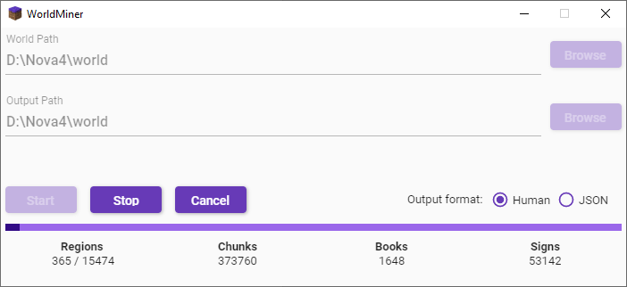

# WorldMiner

    

 

A Minecraft world dataminer with a focus on performance, using all of your processor's cores to scrape worlds faster. Finds books and signs in a world and outputs them to either a human-readable format or JSON for further processing. 

Intended to be compatible with all worlds 1.19 and below.
